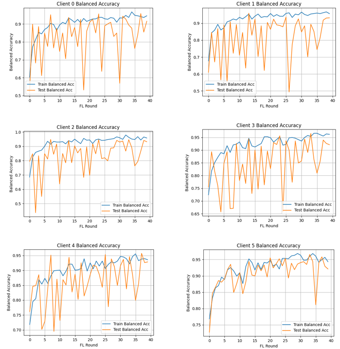
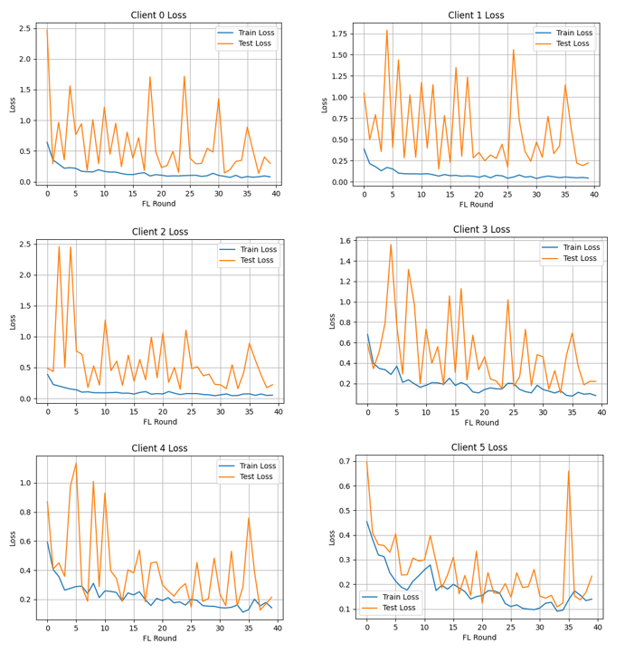
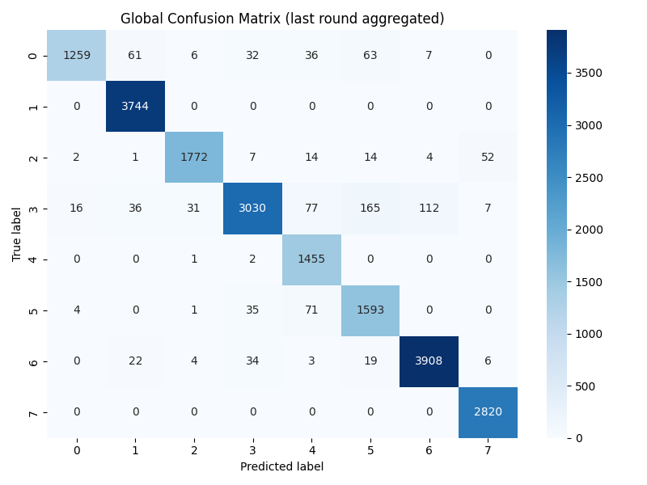
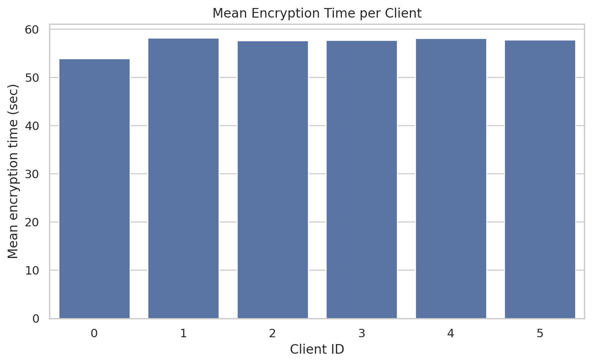
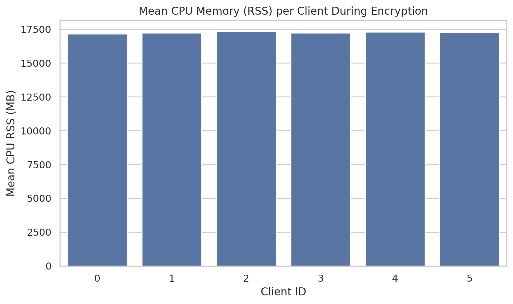
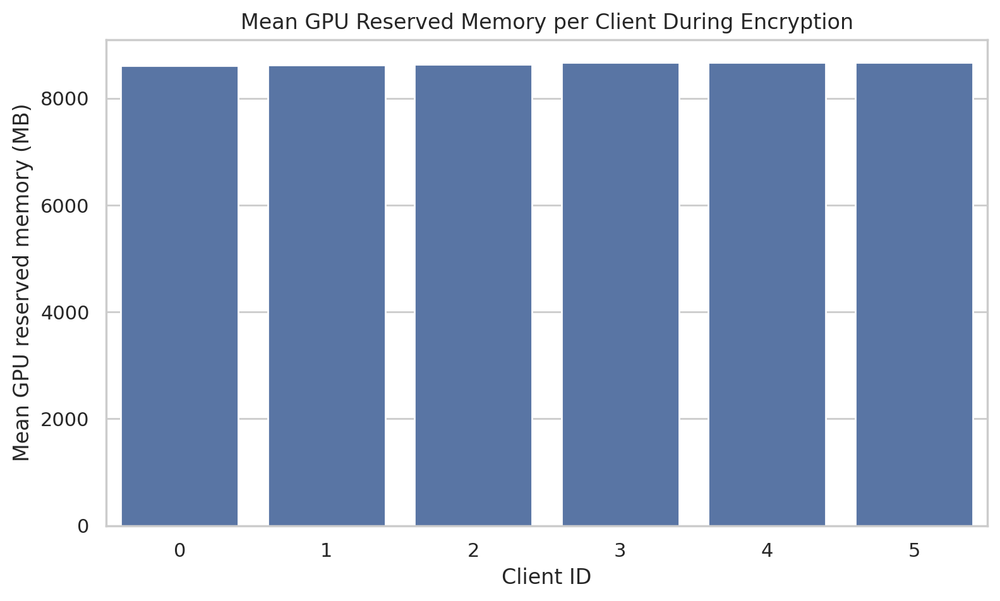
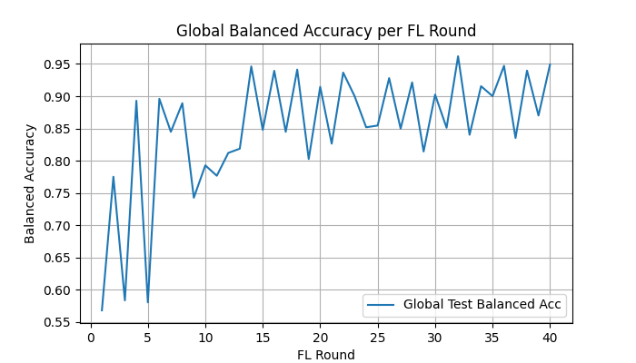
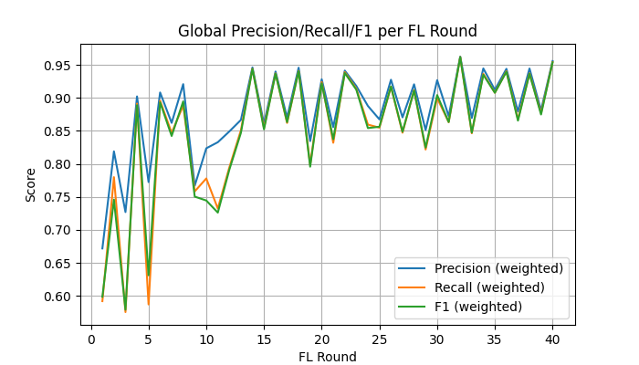

# Federated Vision Transformer with Homomorphic Encryption for Privacy-Preserving Medical AI


A scalable federated learning framework for medical image classification under non-IID data distribution, integrating Vision Transformers with CKKS-based homomorphic encryption for secure and privacy-preserving model aggregation.

---

## Project Highlights

* Privacy-preserving federated learning using Vision Transformers
* Integration of CKKS homomorphic encryption with minimal accuracy degradation
* Achieved **94.41% accuracy with encryption (~0.5% drop)**
* System-level evaluation including latency, memory usage, and communication overhead

---

## Research Context

This work extends a capstone project into a research manuscript currently under review at *Elsevier (Future Generation Computer Systems)*.

---

## Key Contributions

* Federated learning under non-IID client distributions
* Vision Transformer (ViT) architecture for medical image classification
* Selective parameter sharing (FeSViBS framework)
* Integration of CKKS-based homomorphic encryption using TenSEAL
* Secure aggregation under an honest-but-curious threat model

---

## System Architecture


The system simulates multiple distributed clients performing local training. Only encrypted model parameters are shared with a central server.

* No raw data exchange
* Encrypted parameter transmission
* Secure aggregation

---

## Dataset

* BloodMNIST (MedMNIST v2)
* 8-class classification problem
* 17,092 samples
* Non-IID distribution across 6 clients

---

## Results

### Model Performance

| Model                 | Balanced Accuracy |
| --------------------- | ----------------- |
| CNN (ResNet-18)       | 94.28%            |
| ViT (scratch)         | 88.45%            |
| ViT + HE (scratch)    | 82–83%            |
| ViT (pretrained)      | 94.91%            |
| ViT + HE (pretrained) | 94.41%            |

---

### Training Behavior

#### Client Accuracy



#### Client Loss



---

### Confusion Matrix (Final Round)



The strong diagonal structure indicates consistent classification performance across all classes.

---

## System Evaluation

### Encryption Overhead



* Average encryption time per client: **~65–73 seconds**
* Homomorphic aggregation + decryption: **~69 seconds**

---

### Memory Utilization

#### CPU Memory



#### GPU Memory



* CPU usage: **~15–16 GB**
* GPU usage: **~6–8 GB**

---

## Global Metrics





The model improves from approximately **0.68 → 0.81 balanced accuracy**, demonstrating stable convergence.

---

## Key Insights

* Homomorphic encryption introduces **<1% accuracy degradation**
* Selective encryption reduces computational overhead
* Stable convergence achieved under non-IID settings
* Demonstrates feasibility of privacy-preserving AI in healthcare

---

## Repository Structure

```bash
src/        # Federated learning pipeline
models/     # Model architectures (ViT, FeSViBS)
he/         # Homomorphic encryption utilities
app/        # Streamlit interface and inference
data/       # Dataset handling and preprocessing
results/    # Logs and evaluation plots
```

---

## Technology Stack

* Python
* PyTorch
* Vision Transformers
* TenSEAL (CKKS Homomorphic Encryption)
* Streamlit
* Git and Git LFS

---

## Demo

The project includes a Streamlit-based interface for inference.

To run locally:

```bash
pip install -r requirements.txt
python app/app.py
```

---

## Privacy and Security

* Secure aggregation via homomorphic encryption
* Honest-but-curious adversarial model
* No exchange of raw client data

---

## Future Work

* Deployment using Docker and Kubernetes
* Multi-node federated learning setup
* Optimization of encryption latency and memory usage

---

## Author

Alisha Jindal
B.E. Computer Engineering
Thapar Institute of Engineering and Technology

GitHub: https://github.com/Alishajindal
