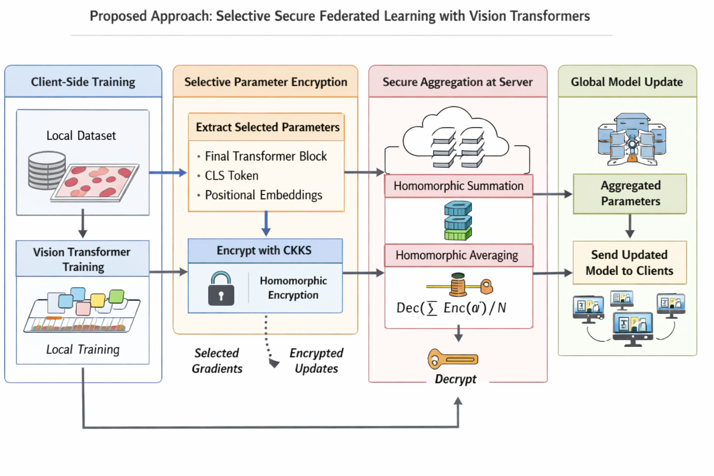

---

title: "Federated Learning with Homomorphic Encryption"
emoji: "🧠"
colorFrom: "blue"
colorTo: "indigo"
sdk: "streamlit"
app_file: "app/app.py"
pinned: false

---

# Federated Vision Transformer with Homomorphic Encryption for Privacy-Preserving Medical AI


A scalable federated learning framework for medical image classification under non-IID data distribution, integrating Vision Transformers with CKKS-based homomorphic encryption for secure and privacy-preserving model aggregation.

---

## Overview

This project addresses the challenge of training deep learning models on sensitive medical data distributed across multiple institutions, where data sharing is not permitted.

The system combines:

* Federated Learning (FL)
* Vision Transformers (ViT)
* Homomorphic Encryption (CKKS via TenSEAL)

to enable **secure model training without exposing raw data**.

---

## Key Contributions

* Federated learning under **non-IID client distributions**
* Vision Transformer-based architecture for medical image classification
* Selective parameter sharing (**FeSViBS framework**)
* Integration of CKKS homomorphic encryption
* Secure aggregation under an honest-but-curious threat model

---

## System Architecture



The system simulates multiple distributed clients performing local training. Only encrypted model parameters are transmitted to a central server.

* No raw data exchange
* Encrypted parameter sharing
* Secure aggregation

---

## Dataset

* BloodMNIST (MedMNIST v2)
* 8-class classification
* 17,092 samples
* Non-IID distribution across 6 clients

---

## Results

### Model Performance

| Model                 | Balanced Accuracy |
| --------------------- | ----------------- |
| CNN (ResNet-18)       | 94.28%            |
| ViT (scratch)         | 88.45%            |
| ViT + HE (scratch)    | 82–83%            |
| ViT (pretrained)      | 94.91%            |
| ViT + HE (pretrained) | 94.41%            |

---

### Global Accuracy Trend


The model demonstrates stable convergence under non-IID conditions.

---

### Confusion Matrix (Final Round)


The strong diagonal structure indicates consistent classification performance across all classes.

---

## System Evaluation

### Encryption Overhead


* Average encryption time per client: ~65–73 seconds
* Homomorphic aggregation + decryption: ~69 seconds

---

## Key Insights

* Homomorphic encryption introduces **<1% accuracy degradation**
* Selective encryption significantly reduces computational overhead
* Stable convergence achieved under non-IID settings
* Demonstrates feasibility of privacy-preserving AI in healthcare environments

---

## Repository Structure

```bash
src/        # Federated learning pipeline
models/     # Model architectures
he/         # Homomorphic encryption logic
app/        # Streamlit interface and inference
data/       # Dataset handling and preprocessing
assets/     # Selected visualizations for documentation
```

---

## Technology Stack

* Python
* PyTorch
* Vision Transformers
* TenSEAL (CKKS Homomorphic Encryption)
* Streamlit
* Git and Git LFS

---

## How to Run (Local)

```bash
pip install -r requirements.txt
python app/app.py
```

---

## Demo

The project includes a Streamlit-based interface for inference.

Upload a blood cell image to obtain predictions using the trained Vision Transformer model.

---

## Privacy and Security

* Secure aggregation using homomorphic encryption
* No exchange of raw client data
* Designed for cross-silo federated learning environments

---

## Future Work

* Deployment using Docker and Kubernetes
* Multi-node federated learning setup
* Optimization of encryption latency and memory usage

---

## Author

Alisha Jindal
B.E. Computer Engineering
Thapar Institute of Engineering and Technology

GitHub: https://github.com/Alishajindal
